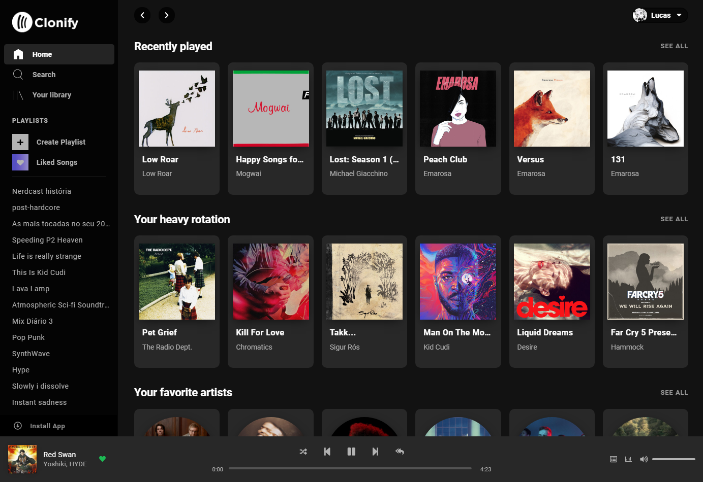

# UI clone - Spotify Web

An UI clone of [Spotify Web](https://open.spotify.com) with login by Spotify API to display public user data, such as favorite songs, album, playlists, artists and etc.



## Built With

- [React](https://reactjs.org) - A declarative, efficient, and flexible JavaScript library for building user interfaces.
- [React Hooks](https://reactjs.org/docs/hooks-intro.html) - A new addition in React 16.8. That allows to use state and other React features without writing a class.
- [React Router](https://reactrouter.com) - A declarative routing for React applications.
- [Axios](https://github.com/axios/axios) - A promise based HTTP client for the browser and node.js.
- [Spotify API](https://developer.spotify.com/documentation/web-api/) - Official Spotify API based on REST principles, that return JSON metadata about music artists, albums, and tracks, directly from the Spotify Data Catalogue.
- [SCSS](https://sass-lang.com) - The most mature, stable, and powerful professional grade CSS extension language in the world.
- [Cookies](https://developer.mozilla.org/en-US/docs/Web/HTTP/Cookies) - Small piece of data stored on the user's computer by the web browser. That allows data persistence even after refreshing the page.

## Demo

Demonstration online by [GitHub Pages](https://pages.github.com) on this [link](https://lucas-santosp.github.io/clone-spotify-web-react/).

## Installation

1 - Get a free Spotify API Key [here](https://developer.spotify.com/dashboard/login).

2 - Create a file in the root folder named .env and type:

```
REACT_APP_API_KEY=<your-key-here>
REACT_APP_REDIRECT_URI=<your-redirect-uri>  // Ex: http://localhost:3000/clone-spotify-web-react/login
```

<small> Note that the "/login" path at the end of the redirect URI is required.</small>

3 - Then with NPM install the packages and run the localhost server:

```
npm install
npm run start
```

## Production

1 - Following the installation steps but add these other environment variables in the .env file:

```
REACT_APP_API_KEY_PROD=<your-key-here>
REACT_APP_REDIRECT_URI_PROD=<your-key-here>
```

2 - And then with NPM run the build script:

```
npm run build
```

## License

This project is licensed under the MIT License - see the LICENSE.md file for details
